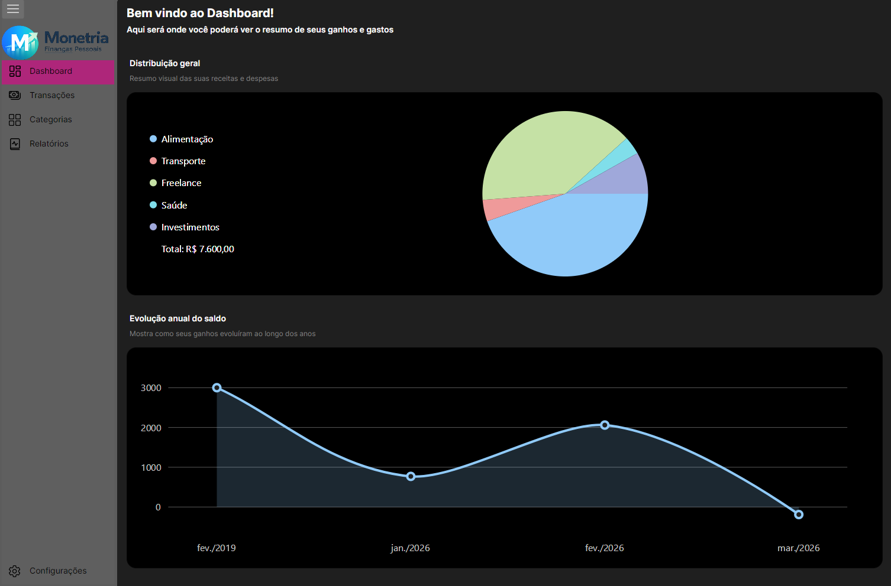
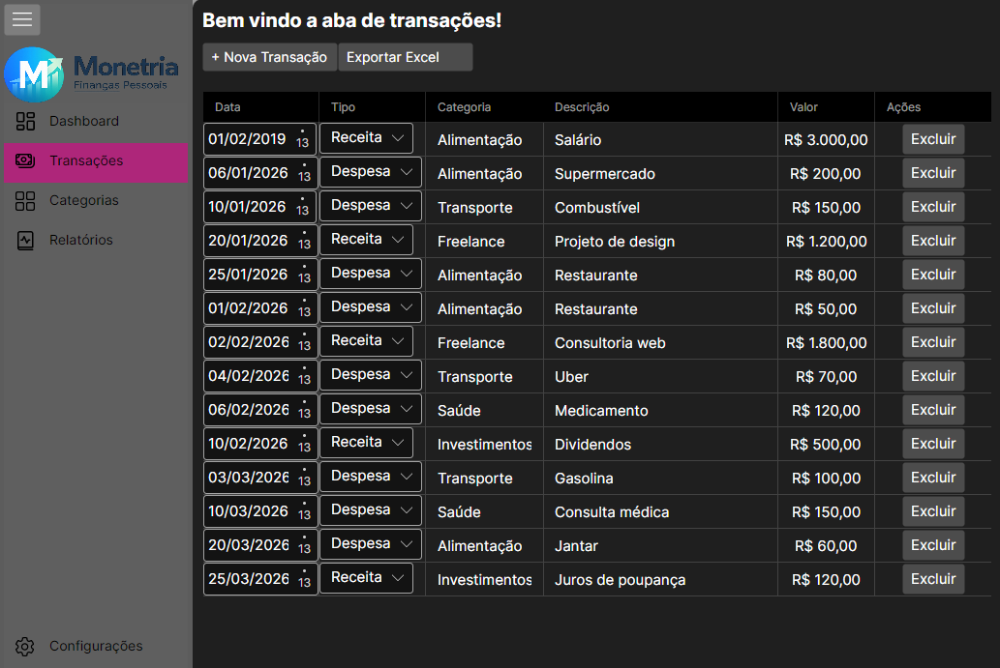
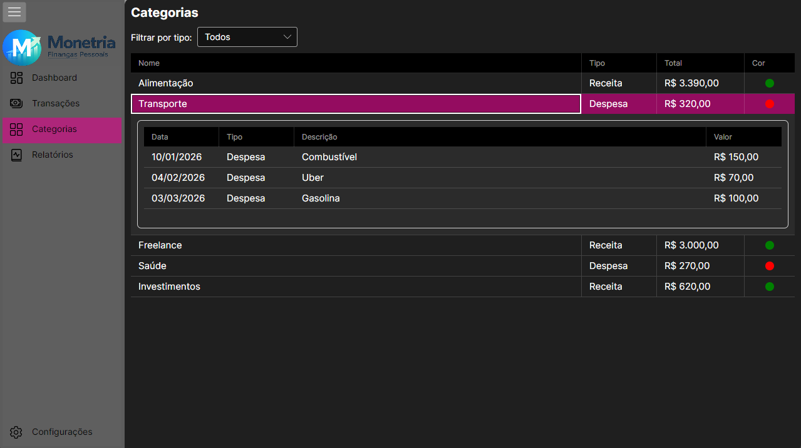
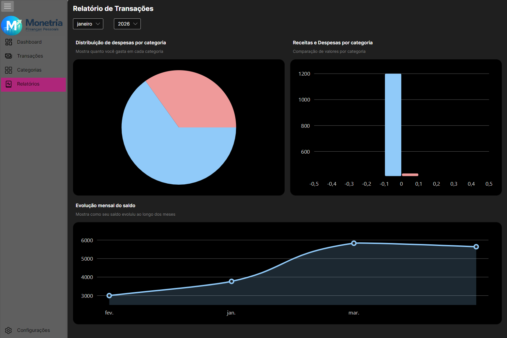
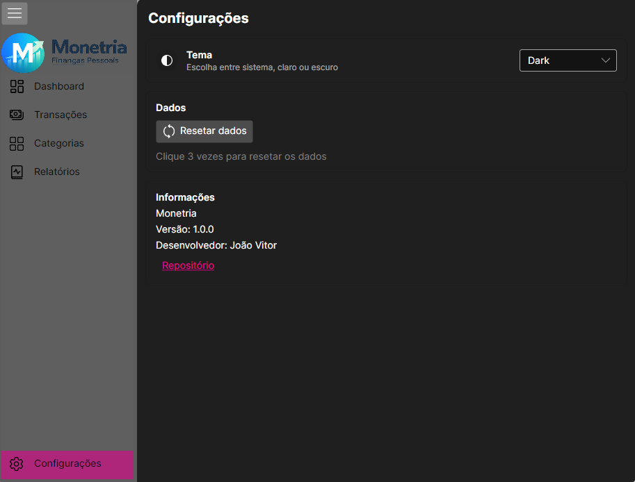

# Monetria

  

**🇧🇷 Português** | [🇺🇸 English]([README_en.md](https://github.com/joaovitored/Monetria/tree/Monetria/EnglishTranslated))

Monetria é uma aplicação de gerenciamento de finanças pessoais, desenvolvida com <a href="https://github.com/AvaloniaUI/Avalonia">Avalonia</a>, .NET 8 e diversas bibliotecas de gráficos e manipulação de planilhas. O app ajuda os usuários a controlar gastos, planejar orçamentos e monitorar sua saúde financeira de forma simples e eficaz.

---

## Índice

- [Funcionalidades por Tópicos](#funcionalidades-por-tópicos)
    - [Dashboard](#dashboard)
    - [Transações](#transações)
    - [Categorias](#categorias)
    - [Relatórios](#relatórios)
    - [Configurações](#configurações)
- [Requisitos do Sistema](#requisitos-do-sistema)
- [Como Executar](#como-executar)
- [Tecnologias e Ferramentas Utilizadas](#tecnologias-e-ferramentas-utilizadas)
- [Licença](#licença)

---

## Funcionalidades por Tópicos

### Dashboard
- Exibe **saldo atual**, total de receitas e despesas.
- Mostra uma **lista de transações recentes**.
- Visualização rápida do fluxo financeiro mensal/anual.

  

### Transações
- **Adicionar, editar e excluir** receitas e despesas.
- Registrar **Data,Tipo(Receita/Despesa),Categoria,Descrição e Valor** .
- Dados armazenados localmente em **JSON**.
- Funciona offline, sem necessidade de conexão com a internet.
- Possibilidade de exportar dados para .xlsx (excel).

  

### Categorias
- Categorize gastos e receitas para análise organizada.
- Visualização dos gastos por categoria no dashboard ou relatórios.
- Tabela mostrando as receitas ou despesas por Data,Tipo,Descrição e Valor.
- Filtro por Todos, Despesa e Receita.

  

### Relatórios
- Gráficos simples de despesas e receitas.
- Visualização de gastos por categoria.
- Filtro por mês e ano.

  

### Configurações
- Alternância de tema **claro/escuro**.
- Resetar os dados dos relatórios.

  

---

## Requisitos do Sistema

### Sistema Operacional
- Windows 10/Windows 11 (build 10240+) x64 ou Linux
- **Observação:** Windows 7, 8 ou 8.1 possivelmente não suportados.

### Suporte
- 64 bits (x64)

### Hardware Recomendado
| Item | Recomendações |
|------|---------------|
| Memória RAM | ≥ 512 MB (1 GB+ recomendado para dados e gráficos maiores) |
| GPU / Gráficos | Suporte mínimo a OpenGL ou DirectX presente no Windows 10+ |
| Espaço em Disco | Alguns MB para o exe, arquivos temporários e assets |

### Software / Runtime
- Nenhuma instalação do .NET necessária, pois o exe é **self-contained** (inclui runtime .NET 8).
- Nenhuma instalação adicional de bibliotecas ou Excel necessária.

### Dependências Incluídas / NuGet
- Avalonia 11.3.11 – Interface do usuário, DataGrid, temas Fluent
- Skia / SkiaSharp – Renderizador gráfico da UI (DLLs nativas extraídas do exe)
- ClosedXML 0.105.0 – Manipulação e criação de arquivos Excel (`.xlsx`)
- LiveChartsCore + SkiaSharpView – Gráficos interativos
- CommunityToolkit.Mvvm – Helpers para MVVM
- Actipro Avalonia Pro – Controles e atualização de tela
- AvaloniaWASM.Storage – Armazenamento local (opcional)

### DLLs Nativas Incluídas
- `libSkiaSharp.dll`
- `libHarfBuzzSharp.dll`
- `av_libglesv2.dll`

### Observações
- Publicado como **single-file exe**, ou seja, o usuário só precisa baixar o `.exe` para rodar.
- Ícone do exe configurado via `<ApplicationIcon>` e exibido na janela do Avalonia.
- Apenas Windows 10/11 x64 é oficialmente suportado.

---

## Como Executar
- Baixe o arquivo `.exe` da release.
- Clique para abrir — **não é necessário instalar nada**.

---

## Tecnologias e Ferramentas Utilizadas

### Frameworks e UI
- AvaloniaUI – Framework XAML multiplataforma para interface gráfica
- SkiaSharp – Renderização gráfica de alta performance
- LiveChartsCore – Gráficos interativos
- Actipro Avalonia Pro – Controles avançados para Avalonia

### Arquitetura e Padrões
- .NET 8 – Plataforma principal da aplicação
- MVVM (Model-View-ViewModel)
- CommunityToolkit.Mvvm – Suporte para padrão MVVM

### Manipulação de Dados
- System.Text.Json – Serialização JSON (armazenamento local)
- ClosedXML – Criação e manipulação de arquivos Excel (.xlsx)

### Ferramentas de Desenvolvimento
- JetBrains Rider
- AvaloniaRider Plugin – Suporte ao designer visual

---

## Licença
[MIT](LICENSE)
