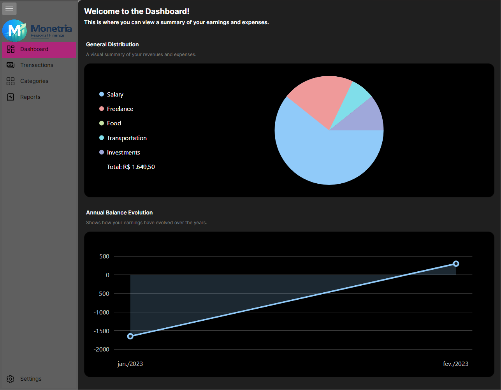
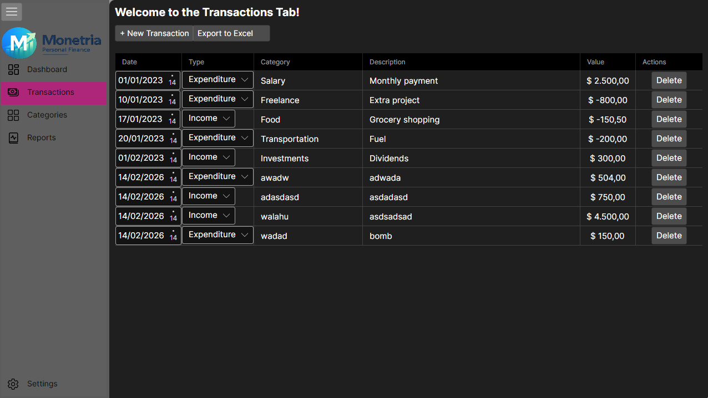
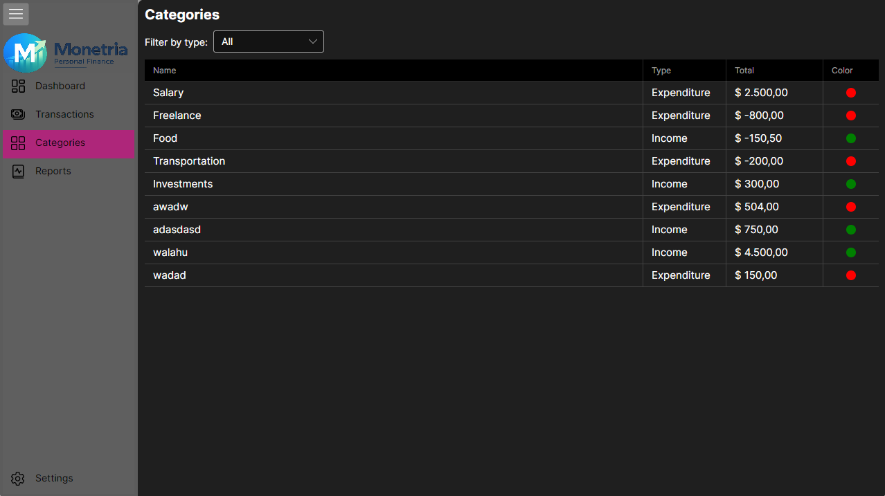
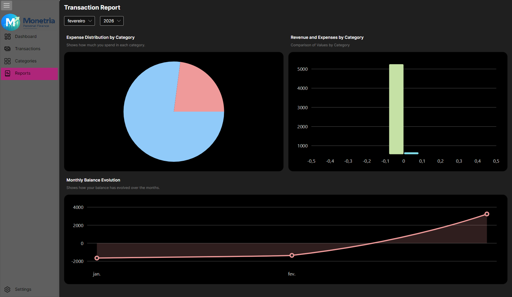
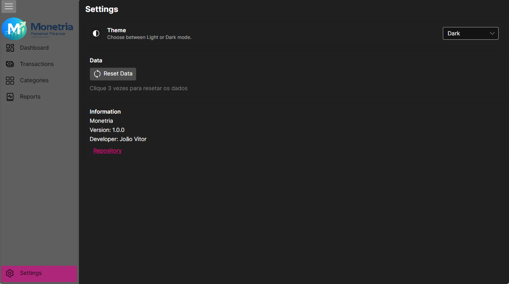

## English Version

# Monetria

  

**🇧🇷 [Português](README.md)** | [🇺🇸 English]

Monetria is a personal finance management application developed with <a href="https://github.com/AvaloniaUI/Avalonia">Avalonia</a>, .NET 8, and various libraries for charting and spreadsheet manipulation. The app helps users control their spending, plan budgets, and monitor their financial health in a simple and effective way.

---

## Table of Contents

- [Features by Topic](#features-by-topic)
    - [Dashboard](#dashboard)
    - [Transactions](#transactions)
    - [Categories](#categories)
    - [Reports](#reports)
    - [Settings](#settings)
    - [System Requirements](#system-requirements)
    - [How to Run](#how-to-run)
    - [Technologies and Tools Used](#technologies-and-tools-used)
    - [License](#license)

---

## Features by Topic

### Dashboard
- Displays **current balance**, total income, and expenses.
- Shows a **list of recent transactions**.
- Quick view of monthly/annual financial flow.

  

### Transactions
- **Add, edit, and delete** income and expenses.
- Register **Date, Type (Income/Expense), Category, Description, and Amount**.
- Data stored locally in **JSON**.
- Works offline, no internet connection required.
- Ability to export data to .xlsx (Excel).

  

### Categories
- Categorize income and expenses for organized analysis.
- View spending by category on the dashboard or in reports.
- Table showing income or expenses by Date, Type, Description, and Amount.
- Filter by All, Expense, and Income.

  

### Reports
- Simple graphs for income and expenses.
- View spending by category.
- Filter by month and year.

  

### Settings
- Toggle between **light/dark** theme.
- Reset report data.

  

---

## System Requirements

### Operating System
- Windows 10/Windows 11 (build 10240+) x64 or Linux
- **Note:** Windows 7, 8, or 8.1 may not be supported.

### Support
- 64-bit (x64)

### Recommended Hardware
| Item | Recommendations |
|------|-----------------|
| RAM | ≥ 512 MB (1 GB+ recommended for larger data and charts) |
| GPU/Graphics | Minimum support for OpenGL or DirectX available on Windows 10+ |
| Disk Space | A few MB for the exe, temporary files, and assets |

### Software / Runtime
- No .NET installation required, as the exe is **self-contained** (includes .NET 8 runtime).
- No additional library or Excel installation needed.

### Included Dependencies / NuGet
- Avalonia 11.3.11 – User interface, DataGrid, Fluent themes
- Skia / SkiaSharp – Graphics renderer for the UI (native DLLs extracted from the exe)
- ClosedXML 0.105.0 – Handling and creating Excel files (`.xlsx`)
- LiveChartsCore + SkiaSharpView – Interactive charts
- CommunityToolkit.Mvvm – MVVM helpers
- Actipro Avalonia Pro – Advanced controls and screen updates
- AvaloniaWASM.Storage – Local storage (optional)

### Included Native DLLs
- `libSkiaSharp.dll`
- `libHarfBuzzSharp.dll`
- `av_libglesv2.dll`

### Notes
- Published as a **single-file exe**, so the user only needs to download the `.exe` to run.
- The exe icon is configured via `<ApplicationIcon>` and displayed in the Avalonia window.
- Officially supported only on Windows 10/11 x64.

---

## How to Run
- Download the `.exe` file from the release.
- Click to open — **no installation required**.

---

## Technologies and Tools Used

### Frameworks and UI
- AvaloniaUI – Cross-platform XAML-based UI framework
- SkiaSharp – High-performance graphics rendering
- LiveChartsCore – Interactive charts
- Actipro Avalonia Pro – Advanced controls for Avalonia

### Architecture and Patterns
- .NET 8 – Main platform of the application
- MVVM (Model-View-ViewModel)
- CommunityToolkit.Mvvm – Support for MVVM pattern

### Data Handling
- System.Text.Json – JSON serialization (local storage)
- ClosedXML – Create and manipulate Excel files (.xlsx)

### Development Tools
- JetBrains Rider
- AvaloniaRider Plugin – Visual designer support

---

## License
[MIT](LICENSE)
